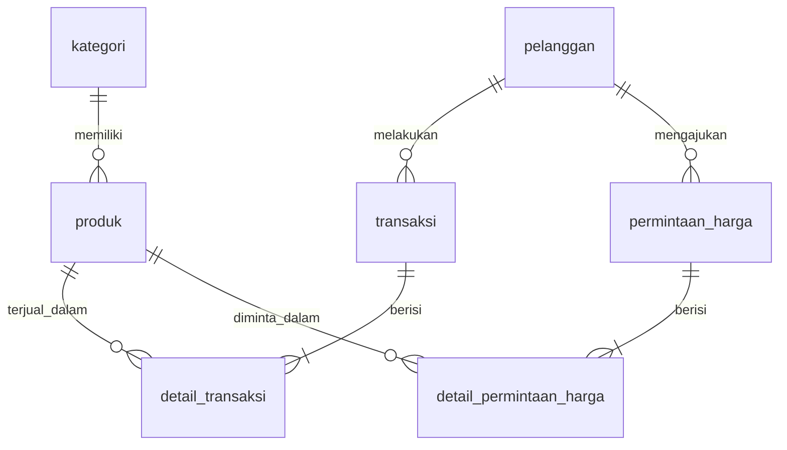

# Dokumentasi Analitik Toko Bangunan Sinar Jaya

Dashboard analitik berbasis web (Python + Flask) yang mengambil data penjualan dari
database, mengolahnya dengan Pandas/NumPy, lalu menampilkan KPI, visualisasi Plotly,
jawaban EDA, dan insight untuk pemilik toko.

## 1. Teknologi

| Bagian | Teknologi |
|---|---|
| Web framework | Flask |
| Database | MySQL (lokal) / SQLite (demo hosting) lewat SQLAlchemy |
| Pengolahan data | Pandas, NumPy |
| Visualisasi | Plotly |
| Tampilan | HTML + Jinja2 + Bootstrap 5 + CSS |
| Deploy | Render + gunicorn |

## 2. Alur pengolahan data

```
Database  ->  Query SQL (JOIN)  ->  Cleaning  ->  Filter  ->  Analisis  ->  Visualisasi + Insight  ->  Dashboard
(MySQL)       load_sales_data()     clean_data()   tanggal/    Pandas       Plotly, build_eda_       Flask +
              load_product_data()                  kategori                 answers(), insights      Jinja2
```

1. **Pengambilan data** (`analysis/eda.py`). `load_sales_data()` menggabungkan
   `transaksi`, `detail_transaksi`, `produk`, dan `kategori` (hanya status `selesai`).
   `load_product_data()` mengambil master produk dan stok terkini, termasuk produk yang
   belum pernah terjual.
2. **Cleaning** (`clean_data`). Konversi tipe tanggal dan angka; buang baris tanpa tanggal,
   dengan jumlah <= 0 atau subtotal negatif, dan detail transaksi duplikat; buat kolom
   turunan (`tanggal`, `bulan`, `tahun`).
3. **Filter** (`app.py`). Rentang tanggal dan kategori dari parameter URL. Input tidak
   valid diabaikan dengan pesan peringatan; tanggal terbalik ditukar otomatis.
4. **Analisis**. KPI, produk terlaris, produk omzet terbesar, penjualan per kategori,
   tren bulanan, analisis stok.
5. **Penyajian**. 5 grafik Plotly dengan catatan interpretasi, tabel stok, bagian
   Hasil EDA, dan daftar insight.

## 3. Struktur database

Skema lengkap: `docs/schema.sql` (diekspor dari MySQL `toko_sinar_jaya`).



| Tabel | Kolom utama | Dipakai analitik |
|---|---|---|
| kategori | id_kategori, nama_kategori, deskripsi | Ya |
| produk | id_produk, id_kategori, nama_produk, deskripsi, spesifikasi, harga, stok, foto | Ya |
| pelanggan | id_pelanggan, nama, no_telepon, email | Ya (jumlah pelanggan) |
| transaksi | id_transaksi, id_pelanggan, tanggal_transaksi, total, status | Ya |
| detail_transaksi | id_detail, id_transaksi, id_produk, jumlah, harga, subtotal | Ya |
| permintaan_harga, detail_permintaan_harga | permintaan harga dari pelanggan | Tidak (fitur website toko) |
| admin | username, password, nama | Tidak |

## 4. Aturan analisis

- **Omzet** = jumlah `subtotal` dari transaksi berstatus `selesai`.
- **Rata-rata nilai transaksi** = rata-rata total subtotal per `id_transaksi`.
- **Perlu restock**: stok <= 10 unit, atau diperkirakan habis dalam <= 21 hari
  (stok / rata-rata penjualan harian pada periode terpilih). Nilai ada di
  `STOK_MINIMUM` dan `RESTOCK_HARI` pada `analysis/eda.py`.
- **Slow moving**: stok >= median stok dan jumlah terjual <= median penjualan.

## 5. Visualisasi (5 grafik)

1. Tren omzet bulanan (garis)
2. Produk terlaris berdasarkan unit (batang horizontal)
3. Produk dengan omzet terbesar (batang horizontal)
4. Penjualan per kategori (pie)
5. Stok vs penjualan per produk (scatter)

Setiap grafik diberi catatan "Interpretasi" otomatis di bawahnya.

## 6. Hasil EDA

Periode data 1 April - 30 September 2026, 300 transaksi, total omzet Rp306.920.000.
Angka berikut dihasilkan dari data pada repo ini, jalankan ulang bila datanya berubah.

| # | Pertanyaan | Jawaban | Interpretasi |
|---|---|---|---|
| 1 | Produk paling banyak terjual | Pipa PVC 1/2 Inch (253 unit), lalu Besi Beton 12mm dan Cat Kayu Avian 1kg | 8% dari seluruh unit terjual; ketersediaannya harus dijaga |
| 2 | Omzet terbesar | Bor Tangan, Rp70.650.000 (23% omzet) | Hanya peringkat 14 dari sisi unit, tetapi harga tinggi; terlaris belum tentu omzet terbesar |
| 3 | Kategori tertinggi | Perkakas, Rp93.665.000 (30,5%) | Tiga kategori teratas menguasai 70% omzet |
| 4 | Periode tertinggi | Agustus 2026, Rp68.261.000 | 33% di atas rata-rata bulanan; hari terbesar: Kamis |
| 5 | Stok tinggi, penjualan rendah | 4 produk, antara lain Besi Beton 8mm (stok 200, terjual 109) | Modal tertahan; pertimbangkan promo atau tunda pembelian |
| 6 | Perlu restock | Bor Tangan (habis +-17 hari), Palu Besi (+-21 hari) | Prioritaskan yang paling cepat habis |
| 7 | Rata-rata nilai transaksi | Rp1.023.067 (median Rp622.000) | Rata-rata > median: sedikit transaksi besar menarik rata-rata naik |
| 8 | Perkembangan penjualan | Cenderung turun, April Rp55,2 jt ke September Rp33,1 jt (-40%) | Fluktuasi antar bulan besar; stok tidak bisa hanya bertumpu pada bulan sebelumnya |

## 7. Insight

1. Pipa PVC 1/2 Inch paling laku, tetapi omzet terbesar justru dari Bor Tangan: produk
   berharga tinggi perlu perhatian khusus walau volumenya kecil.
2. Lima produk teratas menyumbang 56% omzet, jadi omzet toko cukup bergantung pada
   sedikit produk.
3. Perkakas memimpin dengan 31% omzet; Kayu kontribusinya terkecil.
4. Penjualan Agustus 106% lebih besar daripada September (bulan terendah); siapkan stok
   sebelum periode ramai dan selidiki penyebab penurunan di September.
5. Empat produk slow moving (a.l. Besi Beton 8mm, Semen Tiga Roda 50kg, Semen Gresik
   50kg) menahan modal di stok.
6. Bor Tangan dan Palu Besi perlu restock; Bor Tangan paling mendesak sekaligus
   produk beromzet terbesar, sehingga risiko kehabisannya paling mahal.
7. Menaikkan nilai per transaksi (bundling, paket proyek) adalah cara cepat menambah omzet.

## 8. Menjalankan

```bash
pip install -r requirements.txt

# MySQL lokal (default): atur DB_USER, DB_PASSWORD, DB_HOST, DB_PORT, DB_NAME
python app.py

# atau SQLite demo
set DATABASE_URL=sqlite:///demo/sinar_jaya.db      # Windows (cmd)
export DATABASE_URL=sqlite:///demo/sinar_jaya.db   # Linux/macOS
python app.py
```

Membuat ulang CSV dan grafik statis: `python -m analysis.eda`.

## 9. Deploy ke Render

1. Salin data ke SQLite: `python -m scripts.export_mysql_to_sqlite` (hasil `demo/sinar_jaya.db`).
   Skrip hanya menyalin 5 tabel analitik; tabel `admin` dan kolom `no_telepon`/`email`
   pelanggan sengaja tidak ikut karena file ini akan dipublikasikan.
2. Push proyek ke GitHub (tanpa folder `venv`).
3. Di Render, buat Web Service dari repo (otomatis membaca `render.yaml`):
   Build `pip install -r requirements.txt`, Start `gunicorn app:app`,
   variabel `DATABASE_URL=sqlite:///demo/sinar_jaya.db`.

Catatan: layanan gratis Render tertidur bila lama tidak diakses, jadi buka sekali
sebelum demo.

## 10. Screenshot

Simpan di `docs/screenshots/`: (1) dashboard tanpa filter (KPI dan tren),
(2) grafik produk dan kategori, (3) tabel stok rendah dan slow moving,
(4) bagian Hasil EDA dan insight, (5) dashboard dengan filter tanggal + kategori aktif.
